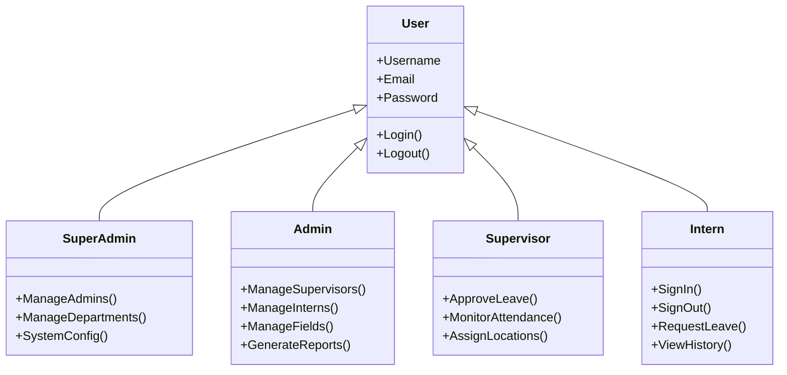

# System Actors

This document defines the actors (users and external systems) that interact with the **Intern Register System**.

## .
**Key Interactions**:
- View Assigned Interns.1. Human Actors

### 1.1 Super Admin
**Description**: The highest-level administrator with unrestricted access to system configuration and user management.
**Primary Responsibilities**:
- Create and manage Administrator accounts.
- Create, update, and deactivate Departments.
- Configure system-wide settings.
- View system-wide reports and logs.
**Key Interactions**:
- Login/Logout.
- Manage Admins (CRUD).
- Manage Departments (CRUD).

### 1.2 Administrator (Department Admin)
**Description**: A manager responsible for the operations within a specific department.
**Primary Responsibilities**:
- Manage Supervisors and Interns within their department.
- Manage Fields of Study associated with their department.
- Assign Sign-in Locations to interns.
- Approve or Reject Leave Requests (escalated or direct).
- Generate departmental attendance and leave reports.
**Key Interactions**:
- Register/Update Interns.
- Create/Update Supervisors.
- Manage Fields.
- Approve/Reject Leave.
- View Reports.

### 1.3 Supervisor
**Description**: A staff member or mentor assigned to oversee the day-to-day activities of a group of interns.
**Primary Responsibilities**:
- Monitor attendance of assigned interns.
- Approve or Reject Leave Requests from assigned interns.
- Update details of interns in their field.
- Assign specific work locations to interns
- Approve/Reject Leave.
- View Attendance History.

### 1.4 Intern
**Description**: A student or trainee who records their daily attendance and requests leave through the system.
**Primary Responsibilities**:
- Sign In (Clock In) at the designated location.
- Sign Out (Clock Out) at the end of the day.
- Submit Leave Requests (Sick, Study, Family).
- View their own profile and attendance history.
**Key Interactions**:
- Sign In/Out (Geolocation required).
- Submit Leave Request.
- View History.

## 2. System Actors

### 2.1 System Timer / Scheduler
**Description**: An internal system process that runs at scheduled intervals.
**Responsibilities**:
- Automatically sign out interns who forgot to sign out at a specific cutoff time (e.g., midnight).
- Send scheduled notifications (reminders).
- Update status of expired leave requests.

### 2.2 SMTP Server (External)
**Description**: External email service provider (e.g., Gmail SMTP).
**Responsibilities**:
- Delivering email notifications to users (Account verification, Leave status updates).

## 3. Actor Hierarchy Diagram

